# Pusoo

**Pusoo** is an **open-source IPTV Player** built with **Flutter**.
It is designed to make IPTV streaming simple, lightweight, and modern - running across multiple platforms.

---

## Features

- **Modern UI** – Clean and minimal design powered by [Forui](https://forui.dev/).
- **Open Source** – Free to use and contribute.

---

## Installation

### 1. Clone the Repository

```bash
git clone https://github.com/cacing69/pusoo.git
cd pusoo
```

## Screenshoot

  Screen | Pictures
 --- | ---
 Setting | 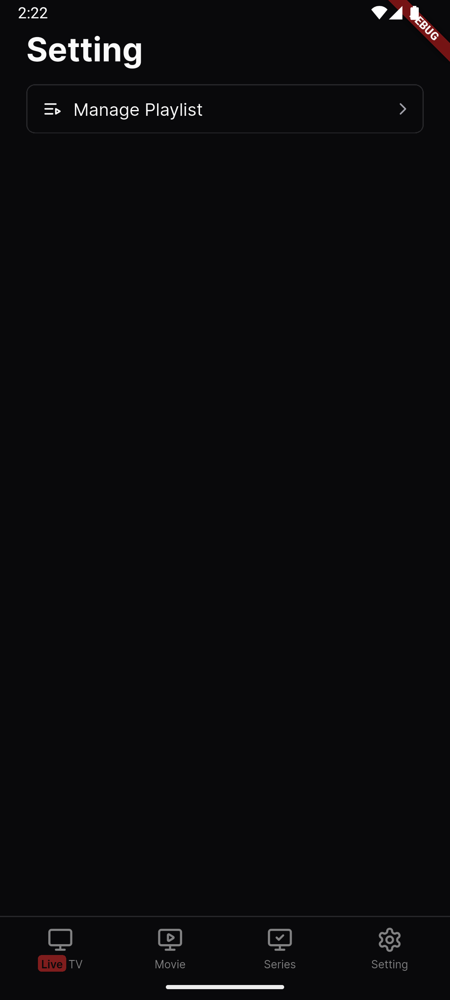
 Setting (Manage Provider) | 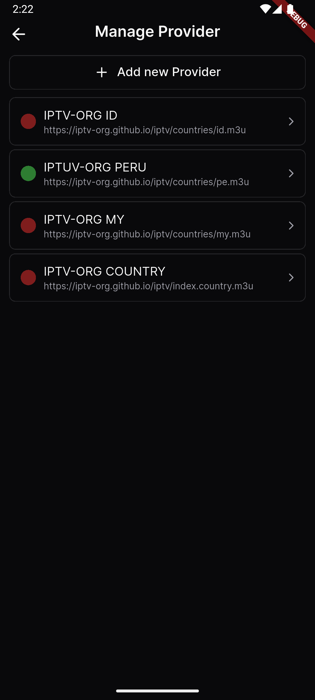&nbsp;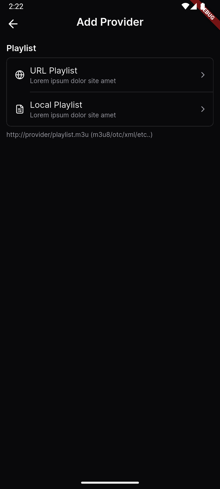&nbsp;&nbsp;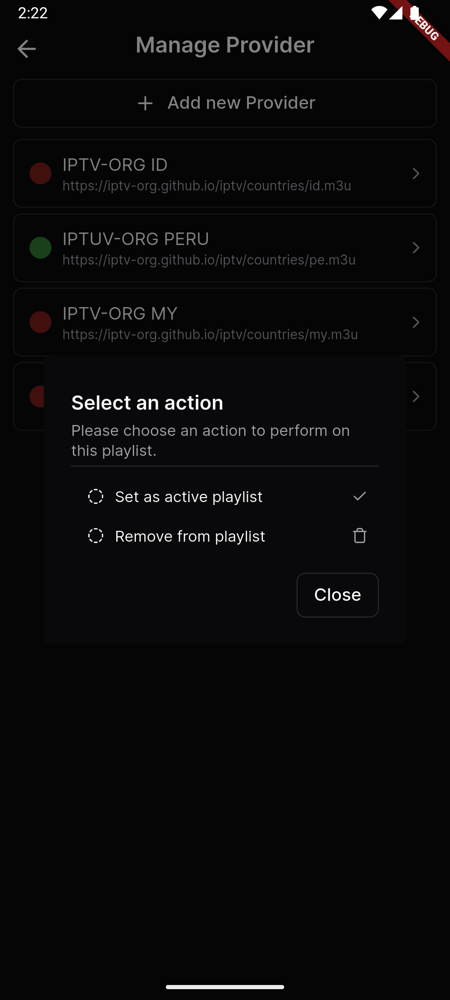&nbsp;
 Home (Live TV) | 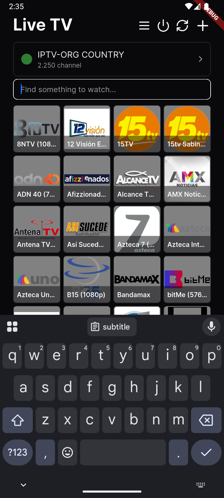&nbsp;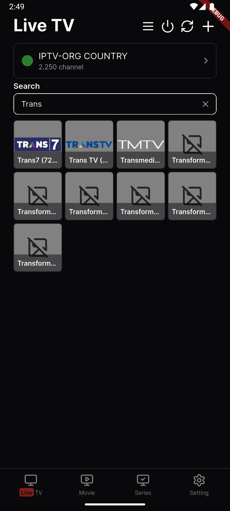&nbsp;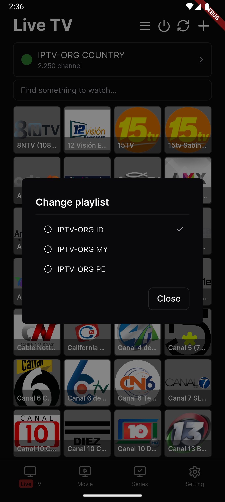&nbsp;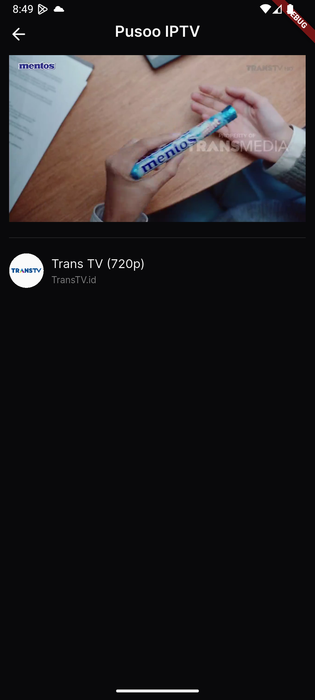&nbsp;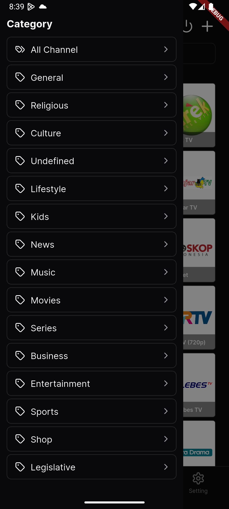
 Home (Movie) | 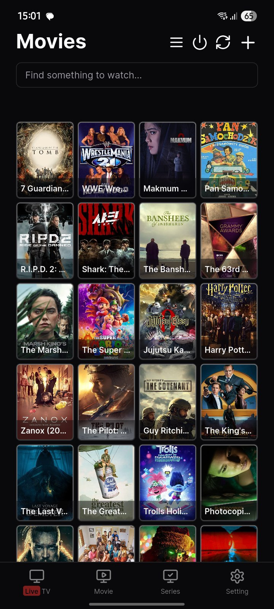&nbsp;&nbsp;
 Home (Series) | 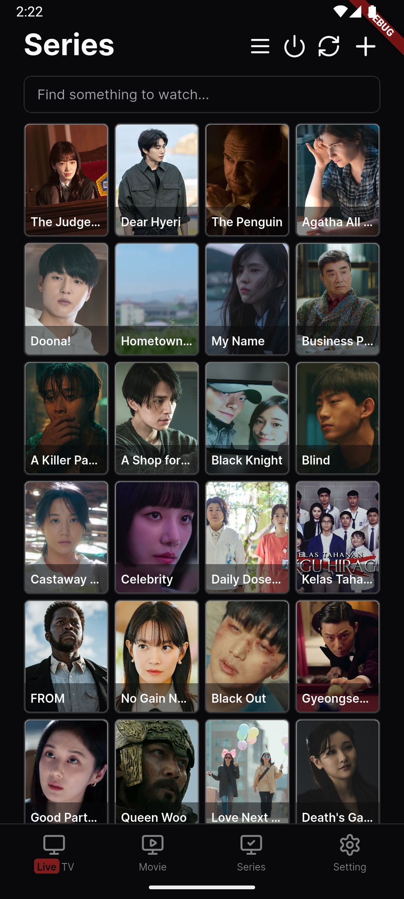

## Usage Policy

- Personal Use Only: These app are intended for personal, non-commercial use.
- No Redistribution for Profit: Do not redistribute or sell these app for commercial purposes.
- Respect Source Terms: Adhere to the terms of service of the original stream providers

## Requirements

- A Working Brain 🧠