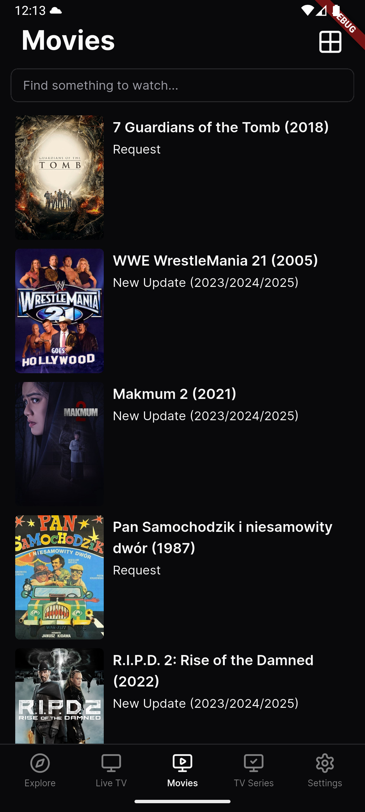

# Pusoo

[](https://www.gnu.org/licenses/gpl-3.0)

<div align="center">
  <a href="https://github.com/cacing69/pusoo"></a>
</div>

**Pusoo** is an **IPTV Player built with Flutter**, licensed under GPLv3.
It is designed to play a wide range of IPTV streams, both live and on-demand, with support for modern streaming formats and DRM.

This project is currently under active development. I'm working on it in my spare time and will release a beta version as soon as possible.

---

## Features

- **Modern UI** - Clean and minimal design powered by [Forui](https://forui.dev/).
- **Open Source** - Free to use and contribute.
- **Popular formats support**: HLS (`.m3u8`), DASH (`.mpd`), MP4, MKV, and more.
- **YouTube support** with YouTube IFrame Player.
- **Public & GitHub Sources** Browse and load playlists from curated Public IPTV sources
- **Subtitle search and integration** (external SRT/VTT).
- **DRM support**: ClearKey & Widevine (when provided by the content provider).
- **Multiple source playlist** with automatic fallback on failure.
- **Subtitles**: external subtitle support (SRT, VTT) with customizable display.

## Notes

- This app **does not provide any IPTV content by default**.
- Users must add their own playlists.
- All channels come from **public sources** or **user-provided playlists**.
- **For legal content only** — the app is not intended to bypass DRM or access paid services without authorization.
- Make sure your device meets the [Requirements](#requirements).
- If you prefer, you can also build the app from source (see [Development](#development)).

## License

Pusoo is released under the **GNU General Public License v3 (GPLv3)**.
See the [LICENSE](LICENSE) file for more details.

---

### Sponsor Pusoo

[](https://github.com/sponsors/cacing69)

## Development

If you want to build **Pusoo IPTV Player** from source, follow these steps:

1. **Clone the repository**

   ```bash
   git clone https://github.com/cacing69/pusoo.git
   cd pusoo

   flutter build apk --release --split-per-abi
   ```

## Usage Guidelines (Non-Legal)

- Please use this app responsibly and for legal content only.
- The app itself is free software under GPLv3, but the content you access may have its own terms of service.
- Respect the terms of original stream providers.
- This is a community project - commercial support or redistribution is allowed under GPLv3, but we encourage contributions back to the project.

## Requirements

- A working brain
- Flutter SDK (latest stable) → [Install guide](https://docs.flutter.dev/get-started/install)
- Dart SDK (bundled with Flutter)
- Android Studio / VS Code (recommended for development)
- Emulator or physical device (Android or iOS)
- Internet connection (for fetching streams)

<div align="center">
  <a href="https://github.com/srctool"></a>
</div>

## Download

Since **Pusoo** is still under active development and not yet stable,
we provide **nightly builds** for testing purposes:

- **Nightly Build (unstable)** → [Latest nightly](https://github.com/cacing69/pusoo/releases/tag/nightly)
- **Pre-release APKs** → [Releases Page](https://github.com/cacing69/pusoo/releases)

### Warning

- Nightly builds may contain bugs or incomplete features.
- Use at your own risk - no warranty provided.
- For the most reliable experience, you may prefer to [build from source](#development).

## Screenshots

Here are some screenshots of **Pusoo IPTV Player**:

<p align="center">
  
  
  
  
  
  
  
  
</p>

### More Screenshots

Check the [Screenshots Gallery](docs/images/features) for more.

## Support & Contribute

Pusoo is a community-driven project, built by me and awesome contributors in our free time.
Your support helps us keep improving Pusoo - and keeps the coffee flowing.

### How you can help

- Star this repo - it means a lot!
- Report bugs and suggest features
- Contribute code, translations, or design ideas
- Support development with a coffee
